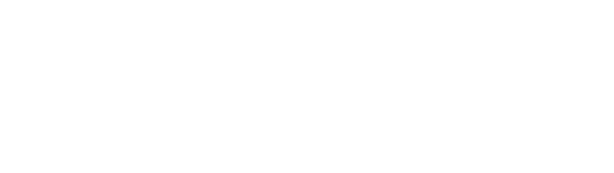
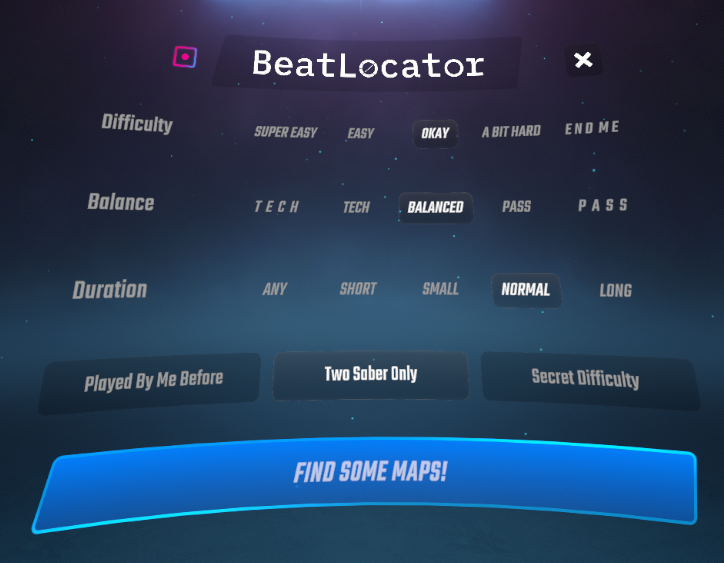
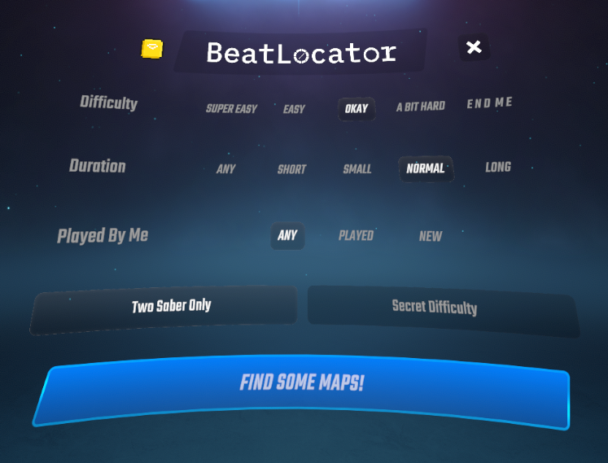
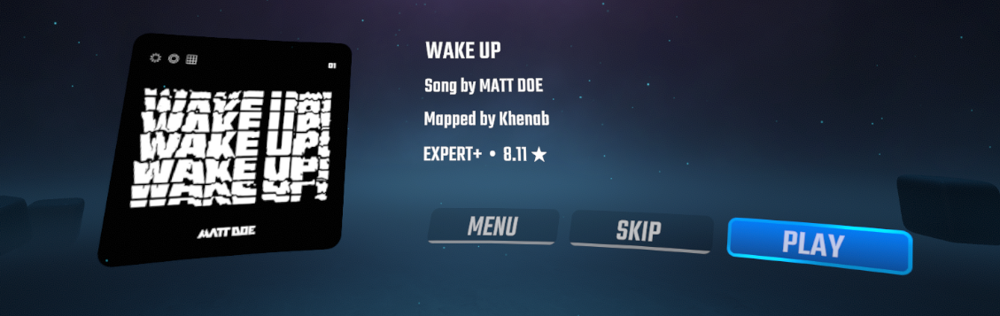
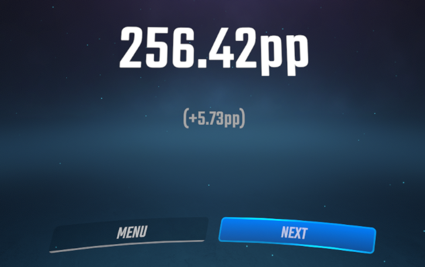

<p align="center">
  
</p>

<p align="center">
  <a href="https://github.com/kalbuus/BeatLocator/actions/workflows/build.yml">
    
  </a>
</p>

<p align="center">
  BeatLocator is a recommendation engine for Beat Saber that finds ranked songs based on your BeatLeader or ScoreSaber profile.
</p>

---

If you find a bug or an optimization problem in the latest version of this mod, please report it using [GitHub Issues](https://github.com/kalbuus/BeatLocator/issues)


## Screenshots

<p align="center">
  
  
</p>

<p align="center">
  
</p>

<p align="center">
  
</p>

## Features

- Personalized difficulty estimation based on your ranked BeatLeader or ScoreSaber results;
- Five skill-relative difficulty presets, from `SUPER EASY` to `END ME`;
- BeatLeader map-style selection ranging from Tech to Pass;
- Duration and played-status filters;
- Two Saber Only and Secret Difficulty modifiers; 
- Weighted map selection with bounded difficulty fallback;
- One-button map download through BetterSongSearch and launch of the exact selected characteristic and difficulty;
- Post-level PP tracking for BeatLeader and ScoreSaber;
- Continuous session support via custom "level failed" and "exit" interfaces.

## Supported Versions

| Beat Saber    | Status      |
|---------------|-------------|
| 1.39.1        | Supported   |
| 1.40.2-1.40.8 | Supported   |
| 1.41.1        | Coming Soon |

Currently, support for versions 1.42+ or standalone is not planned.

## Dependencies

### Required:
- BSIPA
- BSML
- SiraUtil
- SongCore
- BetterSongSearch

### Integration:
- BeatLeader
- ScoreSaber

## Recommendation Engine

BeatLocator analyzes up to 100 ranked results to build a player-specific difficulty range. It filters available ranked maps using the selected settings and makes a weighted recommendation near the chosen difficulty target. 

BeatLeader recommendations also account for the selected Tech/Pass balance, while ScoreSaber recommendations use overall star difficulty.

[Read the full recommendation algorithm here](algorithm.md)

## Post-Level PP Tracking

Post-level tracking is enabled only for maps launched through BeatLocator.
Normal Beat Saber sessions keep their original behaviour.

After a cleared level, Beat Saber first displays its normal results screen and submits the score as usual. 
BeatLocator then waits for the selected ranking service to publish the matching result.

For a new personal best, BeatLocator displays:

- the PP assigned to the submitted score;
- the actual change in the player's total profile PP.

BeatLeader normally reports the profile change through its score-improvement data. 
ScoreSaber profile gain is measured by comparing the player's total PP before and after the uploaded score appears.

## Privacy

This mod does not collect BeatLeader or ScoreSaber login information. 
ScoreSaber profile/map requests use the public ScoreSaber API and the platform ID already provided by Beat Saber. 
BeatLeader-only authenticated requests are routed through the installed BeatLeader mod. 

**BeatLocator does not read any tokens or cookies and never will.**

## Building from Source

If you want to contibute to the mod, you have to build it on your machine. If you just want to play with it, head over to [Releases](https://github.com/kalbuus/BeatLocator/releases/)

### Requirements

- Windows;
- Git;
- PowerShell 5.1 or newer;
- .NET SDK with .NET Framework 4.7.2 build support;
- .NET Framework 4.7.2 Developer Pack;
- Matching mod dependencies described in [build/profiles.md](build/profiles.md).

Third-party mod and game assemblies are not committed to this repository. Place
the required mod files in the matching directory under `dependencies/`, or run
the verified dependency downloader described in
[build/profiles.md](build/profiles.md). When a local Beat Saber directory is not
provided, the build script downloads stripped game references into the ignored
`artifacts/game-references/` directory.

To build for a single supported game version:

```powershell
powershell.exe -NoProfile -ExecutionPolicy Bypass `
  -File .\scripts\build-version.ps1 `
  -GameVersion 1.40.8
```

To build against a local Beat Saber installation:

```powershell
powershell.exe -NoProfile -ExecutionPolicy Bypass `
  -File .\scripts\build-version.ps1 `
  -GameVersion 1.40.8 `
  -BeatSaberDir 'C:\Path\To\Beat Saber'
```

Add the `-Install` switch to copy the resulting plugin into that local game
installation. Without it, the build only creates local artifacts.

To validate and produce the unified build for Beat Saber 1.40.2-1.40.8:

```powershell
powershell.exe -NoProfile -ExecutionPolicy Bypass `
  -File .\scripts\build-1.40.2-1.40.8.ps1 `
  -Configuration Release
```

The distributable DLL and ZIP are written to
`BeatLocator/bin/Release/1.40.2-1.40.8/`.

## License

BeatLocator is licensed under the [MIT License](LICENSE).
