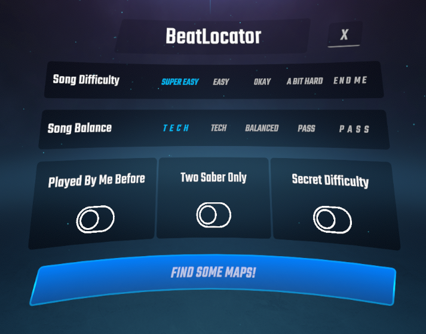

# BeatLocator

BeatLocator is a recommendation engine for Beat Saber, that finds songs based on your BeatLeader profile (ScoreSaber and BeatSaver integrations coming soon). 

Be mindful that this is still an alpha version, so interface bugs and crashes might be present. If you find a bug in the latest version of this mod, please report it using [GitHub Issues](https://github.com/kalbuus/BeatLocator/issues).

## Screenshots




## Mod Capabilities

1. Analysis of recent BeatLeader results;
2. Smart recommendation engine;
3. Selectable map *difficulty* and *balance* levels;
4. Map selection animation;
5. Automatic map loading and launch via BetterSongSearch;

## Supported Versions

| Beat Saber    | Status      |
|---------------|-------------|
| 1.39.1        | Supported   |
| 1.40.2-1.40.8 | Supported   |
| 1.41.1        | Coming Soon |

Currently, support for versions 1.42+ or standalone is not planned.

## Dependencies

### Required:
- BSIPA
- BSML
- SiraUtil
- SongCore
- BetterSongSearch

### Integration:
- BeatLeader

## Algorithm

The song selection works by getting your last ranked scores from BeatLeader, evaluating your skill level and then selecting the songs based on your difficulty and balance selection.

## Privacy

This mod doesn't collect or use your BeatLeader's login information (including your auth token). It uses a public API and only routes some requests through BeatLeader's mod.

## Building from Source

If you want to contibute to the mod, you have to build it on your machine. If you just want to play with it, head over to [Releases](https://github.com/kalbuus/BeatLocator/releases/)

### Requirements

- Windows;
- Git;
- PowerShell 5.1 or newer;
- .NET SDK with .NET Framework 4.7.2 build support;
- .NET Framework 4.7.2 Developer Pack;
- Matching mod dependencies described in [build/profiles.md](build/profiles.md).

Third-party mod and game assemblies are not committed to this repository. Place
the required mod files in the matching directory under `dependencies/`. When a
local Beat Saber directory is not provided, the build script downloads stripped
game references into the ignored `artifacts/game-references/` directory.

To build for a single supported game version:

```powershell
powershell.exe -NoProfile -ExecutionPolicy Bypass `
  -File .\scripts\build-version.ps1 `
  -GameVersion 1.40.8
```

To build against a local Beat Saber installation:

```powershell
powershell.exe -NoProfile -ExecutionPolicy Bypass `
  -File .\scripts\build-version.ps1 `
  -GameVersion 1.40.8 `
  -BeatSaberDir 'C:\Path\To\Beat Saber'
```

Add the `-Install` switch to copy the resulting plugin into that local game
installation. Without it, the build only creates local artifacts.

To validate and produce the unified build for Beat Saber 1.40.2-1.40.8:

```powershell
powershell.exe -NoProfile -ExecutionPolicy Bypass `
  -File .\scripts\build-1.40.2-1.40.8.ps1 `
  -Configuration Release
```

The distributable DLL and ZIP are written to
`BeatLocator/bin/Release/1.40.2-1.40.8/`.

## License

BeatLocator is licensed under the [MIT License](LICENSE).
